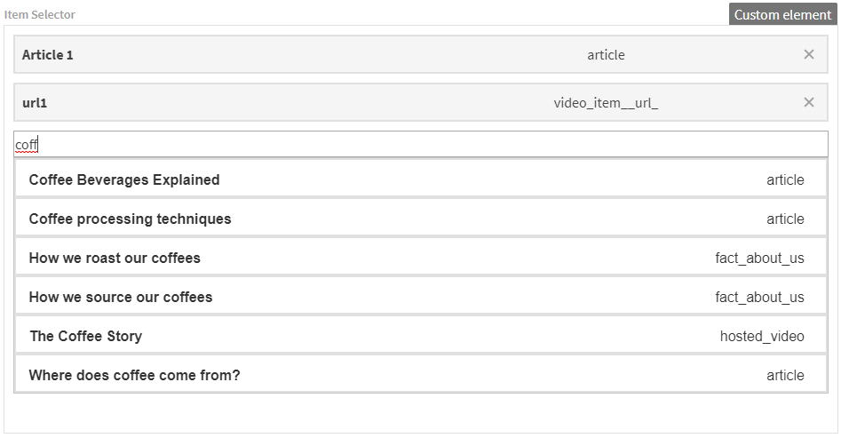

# Item Selector

This is a [custom element](https://docs.kontent.ai/tutorials/develop-apps/integrate/integrating-your-own-content-editing-features) for [Kentico Kontent](https://kontent.ai) that allows you to select a content item from another Kontent project.



## Setup

1. Deploy the code to a secure public host
   - See [deploying section](#Deploying) for a really quick option
1. Follow the instructions in the [Kentico Kontent documentation](https://docs.kontent.ai/tutorials/develop-apps/integrate/integrating-your-own-content-editing-features#a-3--displaying-a-custom-element-in-kentico-kontent) to add the element to a content model.
   - The `Hosted code URL` is where you deployed to in step 1
   - Pass the necessary parameters as directed in the [JSON Parameters configuration](#json-parameters) section of this readme.

## Deploying

Netlify has made this easy. If you click the deploy button below, it will guide you through the process of deploying it to Netlify and leave you with a copy of the repository in your GitHub account as well.

[](https://app.netlify.com/start/deploy?repository=https://github.com/hzik/kontent-custom-element-item-selector)

## JSON Parameters

You need to specify the `projectid` parameter in order to make the element work. The optional `filter` parameter is for filtering just subitems of your project and you can use any filtering described in our documentation (separated by &):

[Content filtering documentation](https://docs.kontent.ai/reference/delivery-api#tag/Filtering-content)

Within the filter you can also specify what language of your items you want to retrieve (a default language is returned OOTB) - [https://docs.kontent.ai/tutorials/develop-apps/get-content/getting-localized-content#a-ignoring-language-fallbacks](https://docs.kontent.ai/tutorials/develop-apps/get-content/getting-localized-content#a-ignoring-language-fallbacks)

```Json
{
    "projectid": "302946ce-a441-00e5-3dba-ec6ccc479168",
    "filter": "system.type=article"
}
```

## Saved Value

The value is saved as a string representing a JSON object. When deserialized, it will look like:

```json
[
  {
    "codename": "article_1",
    "name": "Article 1",
    "language": "en-US",
    "type": "article"
  },
  {
    "codename": "url1",
    "name": "url1",
    "language": "en-US",
    "type":"video_item__url_"
  }
]
```

